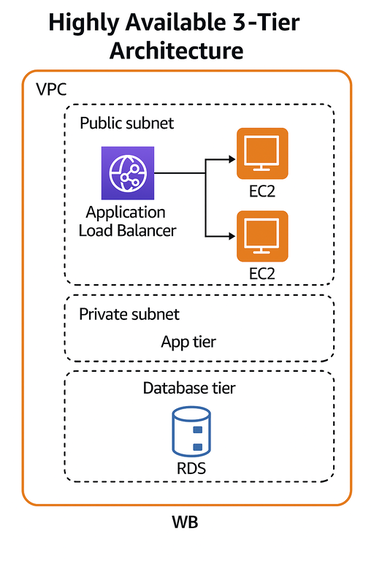
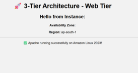

# ☁️ AWS Highly Available 3-Tier Architecture  

This project implements a **fault-tolerant, highly available 3-tier architecture** on AWS using **Terraform**.  
It follows best practices with **Auto Scaling**, **Load Balancing**, and **Multi-AZ RDS deployment** to ensure scalability, reliability, and security.

---

## 🧠 Project Overview

| Tier | AWS Services | Description |
|------|---------------|-------------|
| **Web Tier** | EC2 + Auto Scaling + ALB | Hosts web servers across multiple AZs with load balancing |
| **App Tier** | (Optional) Private EC2 / Lambda | Business logic layer (can be expanded later) |
| **Database Tier** | RDS (MySQL/PostgreSQL) | Multi-AZ database setup for durability |
| **Networking** | VPC, Subnets, Route Tables | Secure public and private subnet design |
| **Security** | Security Groups, IAM Roles | Segregated access between web, app, and DB tiers |
| **Automation** | Terraform | Infrastructure as Code for full automation |

---

## 🏗️ Architecture Diagram

---

## 📂 Project Structure

aws-3tier/
├── main.tf
├── outputs.tf
├── terraform.tfvars
└── variables.tf

## Features

    Custom VPC with public and private subnets across 2 AZs
    Auto Scaling Group for EC2 web servers
    Application Load Balancer (ALB) for load distribution
    RDS MySQL (Multi-AZ) for high availability
    Security Groups enforcing tier-based access control
    Cloud-ready setup — easily monitored and scalable

## Step-by-Step Setup Instructions

    1️⃣ Initialize Terraform
        terraform init

    2️⃣ Plan Deployment
        terraform plan

    3️⃣ Apply Configuration
        terraform apply -auto-approve

    4️⃣ Access the Web Application
        terraform output

## Sample Output

