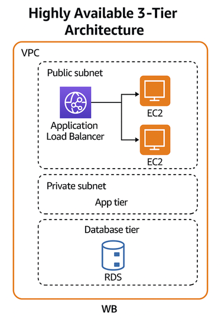
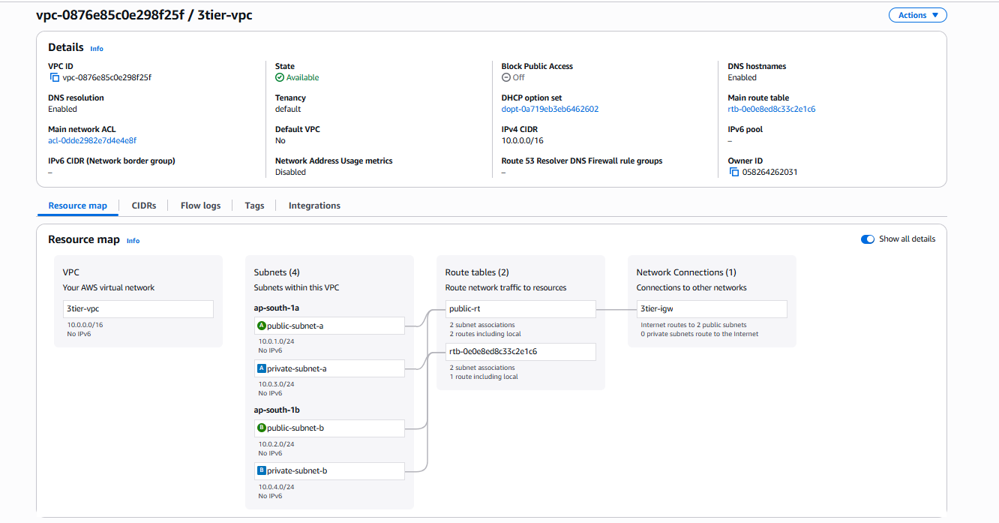
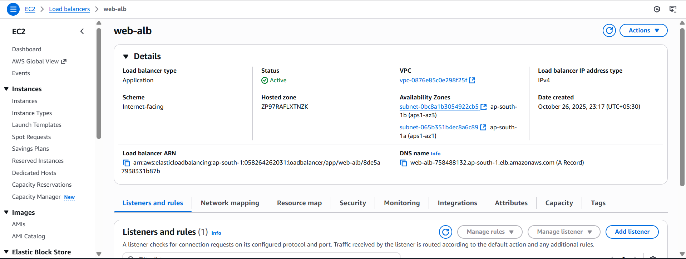
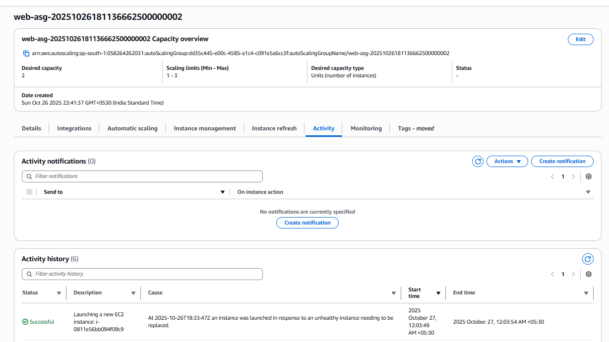
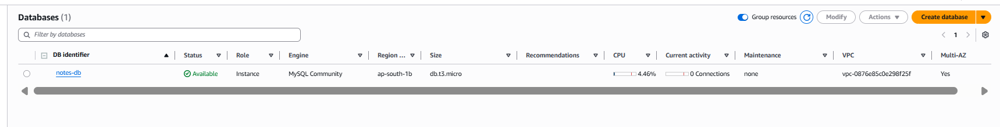
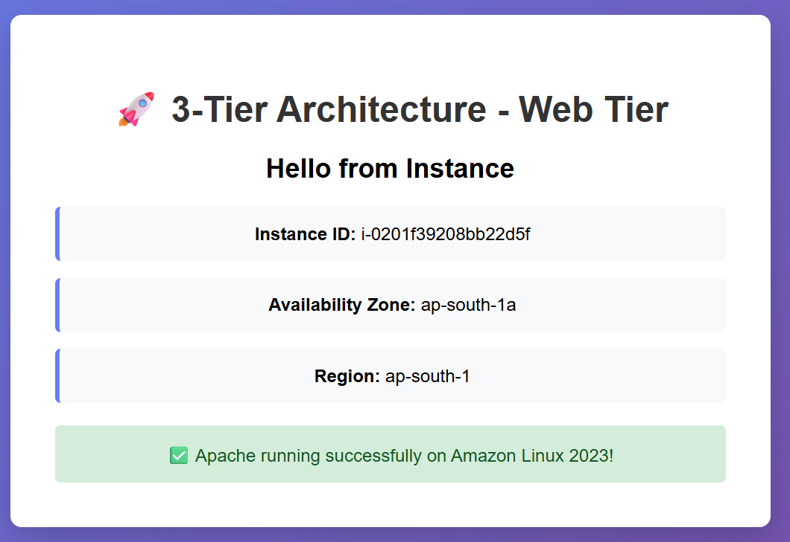

# AWS Highly Available 3-Tier Architecture


> Production-grade, fault-tolerant AWS 3-tier architecture built using Terraform (IaC).

---

## Table of Contents
- [Overview](#overview)
- [Architecture](#architecture)
- [Technologies Used](#technologies-used)
- [Features](#features)
- [Project Structure](#project-structure)
- [Prerequisites](#prerequisites)
- [Setup Instructions](#setup-instructions)
- [Screenshots](#screenshots)
- [Contact](#contact)

---

## Overview
This project provisions a **3-tier AWS architecture** designed for **high availability, fault tolerance, and scalability** using **Terraform**.  
It deploys a complete VPC setup, Auto Scaling EC2 instances behind an Application Load Balancer, and a Multi-AZ RDS MySQL database.

---

## Architecture


### Traffic Flow
```
Internet → Application Load Balancer → Auto Scaling EC2 → RDS (MySQL Multi-AZ)
```

---

## Technologies Used

| Category | Tool | Description |
|-----------|------|-------------|
| IaC | Terraform | v1.2 + (AWS Provider ≥ 5.0) |
| Cloud Platform | AWS | EC2, RDS, VPC, ALB, Auto Scaling |
| Web Server | Apache | Installed via EC2 user data |
| OS | Amazon Linux 2023 | Lightweight, secure base image |
| Database | RDS MySQL | Multi-AZ enabled |
| Monitoring | CloudWatch | Metrics and scaling triggers |
| Security | IAM, Security Groups | Tier-based access control |

---

## Features
- Multi-AZ high availability  
- Auto Scaling Group for dynamic EC2 scaling  
- Application Load Balancer with health checks  
- Private RDS MySQL with automated backups  
- Secure VPC with public/private subnets  
- Full automation via Terraform (IaC)  
- Free-tier friendly for demo and testing  

---

## Project Structure
```
aws-3tier/
├── main.tf
├── variables.tf
├── outputs.tf
├── terraform.tfvars
├── scripts/
│   └── user_data.sh
├── screenshots/
│   ├── image_50_1_73.png
│   └── image-1_26.png
├── .gitignore
└── README.md
```

---

## Prerequisites

### Required Tools
- AWS Account with appropriate IAM permissions  
- Terraform v1.9 + installed  
  ```bash
  terraform --version
  ```
- AWS CLI configured  
  ```bash
  aws configure
  # Enter: Access Key, Secret Key, Region (e.g., ap-south-1)
  ```
- SSH Key Pair created in AWS Console (for EC2 access)

### IAM Permissions Required

| AWS Service | Required Permissions |
|--------------|----------------------|
| EC2 | Create/modify instances, launch templates, ASG, ALB |
| VPC | Create VPCs, subnets, route tables, internet/NAT gateways |
| RDS | Create DB instances, subnet groups, parameter groups |
| IAM | Create roles, instance profiles |
| CloudWatch | Create alarms, dashboards, metrics |

---

## Setup Instructions

### 1. Clone Repository
```bash
git clone https://github.com/PrajwalRedee/aws-3-tier-architecture.git
cd aws-3-tier-architecture
```

### 2. Configure Variables
Create or edit **terraform.tfvars**:
```hcl
region           = "ap-south-1"
project_name     = "aws-3tier-architecture"
key_pair_name    = "your-keypair-name"
db_user          = "admin"
db_pass          = "YourSecurePassword123!"
instance_type    = "t3.micro"
multi_az         = true
```

> Never commit `terraform.tfvars`; it’s in `.gitignore`.

### 3. Initialize Terraform
```bash
terraform init
```

### 4. Review Plan
```bash
terraform plan
```

### 5. Apply Configuration
```bash
terraform apply -auto-approve
```

### 6. Access the Application
```bash
http://<alb_dns_name>
```
or  
```bash
curl http://<alb_dns_name>
```
### 7. Destroy Resources (to avoid costs)
```bash
terraform destroy -auto-approve
```
---

## Screenshots

### 🏗️ Architecture Diagram


### 🌐 VPC Overview


### ⚖️ Application Load Balancer


### ⚙️ Auto Scaling Activity


### 🗄️ RDS Multi-AZ


### 💻 Web Application Output


---

## Contact
**K Prajwal**  
Associate Devops Engineer | AWS & DevOps Enthusiast  

📧 [prajwalredee@gmail.com](mailto:prajwalredee@gmail.com)  
🔗 [linkedin.com/in/prajwalredee](https://www.linkedin.com/in/prajwalredee)  
🐙 [github.com/PrajwalRedee](https://github.com/PrajwalRedee)  
📍 Bangalore, India  

---
